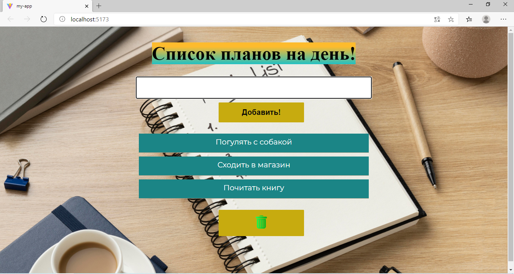

# TO DO LIST

- A simple and intuitive task management application built with React. Keep track of your daily tasks, mark them as complete, and stay organized.

## Technologies Used

- REACT
- JavaScript 
- HTML 
- CSS

### Features

1. Add new tasks 
2. Mark tasks as complete/incomplete
3. Delete tasks
4. Responsive design
5. Develop applications that are user-friendly 

### My project provides the following interface:

#### Installation

1. Clone the repository:

git clone <repository-url>
cd to-do-list 

2. Install dependencies:

npm install # or yarn install

3. Running the Application: 

npm start # or yarn start

4. Open http://localhost:5173 to view it in the browser.

##### Contributing

- Fork the project
- Create your feature branch (git checkout -с new-branch-test)
- Commit your changes (git commit -m 'Add some Feature')
- Push to the branch (git push origin feature)
- Open a Pull Request

##### License

This project is created for educational purposes!
This project is licensed under the MIT License - see the LICENSE file for details.

